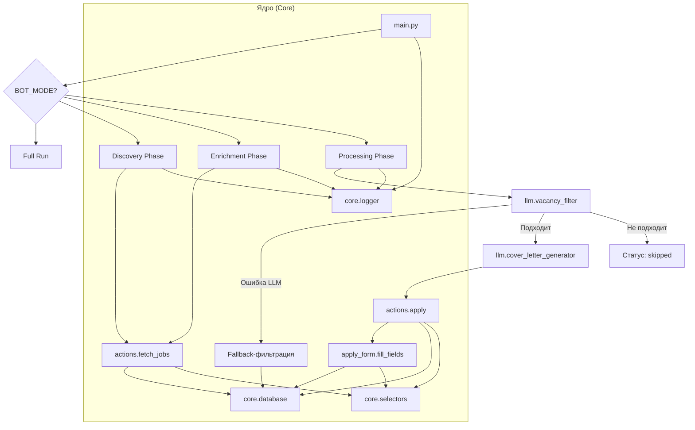

# 2. Архитектура приложения

В этом разделе описывается высокоуровневая архитектура проекта **LinkedIn Easy Apply Bot**, структура его директорий и принципы взаимодействия ключевых компонентов.

## 2.1. Структура директорий

Проект имеет модульную структуру, где ответственность четко разделена между компонентами. Это упрощает навигацию, поддержку и расширение кодовой базы.

```
.
├── actions/                # Основные атомарные действия (login, fetch, apply)
├── apply_form/             # Модули для заполнения полей формы "Easy Apply"
├── core/                   # Ядро проекта (БД, логгер, селекторы)
├── docs/                   # Техническая документация
├── llm/                    # Интеграция с Большими Языковыми Моделями (AI)
├── phases/                 # Основные фазы работы бота (Discovery, Enrichment, Processing)
├── tests/                  # Unit и интеграционные тесты
├── main.py                 # Точка входа в приложение
├── config.py               # Основной файл конфигурации
├── jobs.db                 # База данных SQLite
└── ...                     # Другие файлы конфигурации и проекта
```

- **`actions/`**: Содержит функции, выполняющие конкретные, изолированные действия в браузере, такие как вход в систему, сбор данных о вакансиях или отправка заявки.
- **`apply_form/`**: Пакет, отвечающий за сложную логику заполнения различных полей (текстовых, многовариантных, чекбоксов) в форме "Easy Apply".
- **`core/`**: Центральные, сквозные компоненты проекта. `database.py` управляет состоянием, `logger.py` — логированием, а `selectors.py` хранит CSS-селекторы, отделяя их от основной логики.
- **`docs/`**: Здесь находится вся техническая документация проекта.
- **`llm/`**: Один из ключевых модулей, инкапсулирующий всю логику взаимодействия с LLM: от клиентов для разных провайдеров до фильтрации вакансий и генерации писем.
- **`phases/`**: Оркестрирует бизнес-логику, разделяя весь процесс на три последовательные фазы.
- **`tests/`**: Содержит все тесты, разделенные на `unit` и `integration`.

## 2.2. Точка входа и режимы работы

- **Точка входа:** `main.py` является главным скриптом, который запускает и координирует работу всего приложения. Он инициализирует окружение (логгер, БД), выполняет вход в систему и запускает фазы в соответствии с выбранным режимом.

- **Режимы работы:** Поведение бота определяется переменной `BOT_MODE` в файле `config.py`. Это позволяет гибко управлять тем, какие именно задачи будет выполнять бот при запуске:
    - `discovery`: Только поиск и сохранение ссылок на вакансии.
    - `enrichment`: Поиск и обогащение вакансий детальной информацией.
    - `processing`: Только обработка (фильтрация и подача заявок) уже обогащенных вакансий.
    - `full_run`: Последовательное выполнение всех трех фаз.

## 2.3. Схема взаимодействия компонентов

Следующая диаграмма иллюстрирует, как компоненты проекта взаимодействуют друг с другом в рамках основного рабочего процесса.



**Описание потока:**

1.  `main.py` запускает одну или несколько фаз в зависимости от `BOT_MODE`.
2.  Фазы `Discovery` и `Enrichment` используют `actions.fetch_jobs` для сбора данных из LinkedIn.
3.  Фаза `Processing` является наиболее комплексной:
    - Она использует `llm.vacancy_filter` для интеллектуальной оценки вакансии.
    - Если вакансия подходит, `llm.cover_letter_generator` создает сопроводительное письмо.
    - Затем `actions.apply` инициирует подачу заявки, делегируя заполнение полей модулям из `apply_form`.
    - Если LLM-фильтрация дает сбой, включается резервная логика на основе регулярных выражений.
4.  Все компоненты взаимодействуют с `core.database` для чтения и записи состояния, используют `core.selectors` для поиска элементов на странице и `core.logger` для логирования своих действий.

---

## Дополнительная информация

- [Описание компонентов](components.md) - Детальное описание каждого модуля
- [Схема базы данных](database-schema.md)
- [Workflow и поток данных](workflow.md)
- [LLM интеграция](llm-integration.md)
- [Руководство по началу работы](getting-started.md)