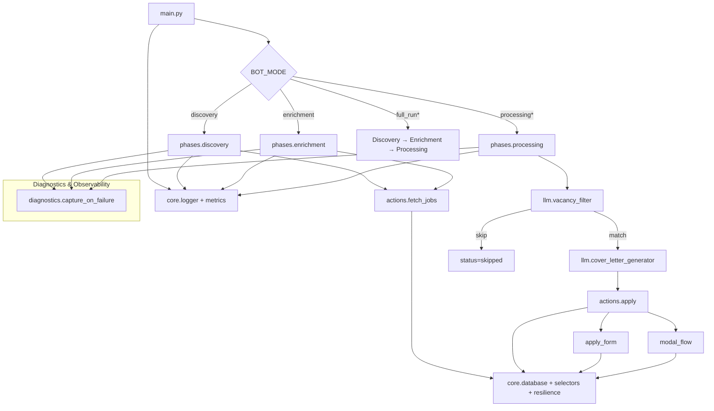

# Архитектура приложения

Документ описывает высокоуровневое устройство LinkedIn Easy Apply Bot: структуру директорий, главный рабочий поток, интеграцию с LLM и поперечные подсистемы (устойчивость, диагностика, наблюдаемость).

## Структура директорий

```
.
├── main.py                 # Точка входа
├── config.py               # Pydantic-конфигурация (Login, Session, BOT_MODE, LLM и др.)
├── actions/                # Атомарные сценарии работы в браузере (login, fetch, apply)
├── apply_form/             # Процедурное заполнение форм Easy Apply (константные поля)
├── modal_flow/             # Правила, стратегии и LLM-делегаты для динамических модальных окон
├── core/                   # База данных, логирование, селекторы, метрики, утилиты, resilience
├── diagnostics/            # Сбор HTML/скриншотов/HAR/trace и PII-маскирование при сбоях
├── phases/                 # Оркестраторы Discovery / Enrichment / Processing
├── llm/                    # LLM-клиенты, промпты, фильтр вакансий, генератор писем, схемы
├── tests/                  # Unit и integration тесты (pytest + playwright)
├── docs/                   # Техническая документация
├── scripts/, scripts2/     # Сервисные скрипты и отладочные утилиты
├── memory-bank/            # Хранилище знаний для модального движка
├── apply_form/, demo_form/ # POC и вспомогательные данные
└── jobs.db, test.db        # SQLite базы
```

Ключевые директории:

- `core/`:
  - `database.py` управляет SQLite (`vacancies`, `run_history`).
  - `logger.py` строит структурированный `structlog` с выводом в файл/консоль.
  - `metrics.py` собирает latency/счетчики и пишет JSON-метрики.
  - `resilience.py` инкапсулирует retry + circuit breaker (SelectorExecutor, ResilienceExecutor).
  - `selectors.py`, `utils.py` содержат общий DOM- и вспомогательный функционал.

- `modal_flow/`: движок заполнения сложных форм. `rules_engine.py` комбинирует heuristics, `RuleStore`, LLM-делегата и авто-генерацию правил; `strategies/` реализуют конкретные способы заполнения; `llm_delegate*.py` оформляет взаимодействие с OpenAI и др.

- `diagnostics/`: `capture.py` управляет сбором артефактов (HTML, скриншоты, консоль, HAR/trace), `masking.py` скрывает PII, `storage.py` ограничивает количество артефактов, `types.py` описывает опции. Поддерживается включение по фазам и ротация.

## Конфигурация и точки входа

- `config.py` описывает все настройки через Pydantic-модели: учетные данные, лимиты (`max_jobs_to_*`, `max_applications_per_day`), режимы (`BotModeConfig`: `discovery`, `enrichment`, `processing`, `processing_submit`, `full_run`, `full_run_submit`, `test_logging`), параметры LLM, правила поиска, diagnostics и resilience.
- `main.py` инициализирует конфигурацию, логирование, БД, playwright, выполняет вход и запускает выбранные фазы, уважая лимиты и режим `SUBMIT`.

## Основной рабочий поток



`processing*` и `full_run*` имеют варианты с `*_submit`, в которых финально отправляется заявка (иначе dry-run).

## Фазы

1. **Discovery**
   - Вызывает `actions.fetch_jobs.fetch_job_links_user()` (или смежные функции) и записывает вакансии в `jobs.db` со статусом `discovered`.
   - Соблюдает `max_jobs_to_discover` и `job_search_period_seconds`.

2. **Enrichment**
   - Берет `discovered` вакансии, открывает страницы, извлекает описание, требования, обновляет запись (`status = enriched`).
   - После нескольких ошибок включает отложенный повтор (статус `enrichment_error`).

3. **Processing**
   - Загружает `enriched` вакансии, фильтрует через `llm.vacancy_filter` (с fallback на regex/keywords при ошибках).
   - Подходящие: генерирует сопроводительное письмо (`llm.cover_letter_generator`), запускает `actions.apply`.
   - Заполнение формы: сначала переиспользуются готовые блоки `apply_form/` (телефон, документы), затем `modal_flow` определяет стратегию для динамических вопросов (эвристики → правила → LLM).
   - Статусы: `applied`, `skipped_filter`, `error`, `enrichment_error`.

## Интеграция с LLM

- `llm/client_factory.py` выбирает клиента (OpenAI, Anthropic, Ollama).
- `llm/llm_client.py` унифицирует вызовы (stream/offline).
- `vacancy_filter.py` возвращает `SuitabilityResult` с объяснениями, языком описания и fallback-кодом.
- `cover_letter_generator.py` использует шаблоны из `prompts.py` и профиль кандидата (`resume_utils`).
- `structured_schemas.py` описывает JSON-схемы для валидации ответов.
- `modal_flow/strategy_generator.py` может вызывать LLM отдельно для генерации новых правил; `rules_validator` фильтрует предложения.

## Наблюдаемость и надежность

- **Resilience**: `core/resilience.py` реализует многоуровневые retry (экспоненциальные задержки, override per selector), circuit breaker с мониторингом последовательных ошибок, graceful recovery (навигация, очистка workflow).
- **Ошибки**: критические исключения не скрываются, bubbling до фаз → статус `error`. Фазы умеют ставить `enrichment_error` для отложенной повторной обработки.
- **Диагностика**: при `DiagnosticsConfig.enable_on_failure=True` собираются HTML/скриншоты/console, опционально HAR и Playwright trace. Артефакты именуются по фазе/вакансии/типу ошибки, PII замаскированы, действует лимит на количество.
- **Метрики**: `core.metrics.MetricsCollector` агрегирует время выполнения, счетчики успехов/ошибок, экспортирует JSON; используется в фазах и действиях.

## Данные и артефакты

- `jobs.db` — основное хранилище. Таблица `vacancies` содержит статусную машину (`discovered`, `enriched`, `processing_error`, `applied`, `skipped_filter`, `enrichment_error` и др.), `run_history` фиксирует таймстемпы запусков.
- Логи (`logs/`) включают application log и metrics JSON.
- Диагностические артефакты (`logs/diagnostics/`) структурированы по фазе и job_id.
- `memory-bank/` хранит сэмплы ответов/правил, которые `modal_flow` использует при автообучении.

## Дополнительные материалы

- `docs/project-structure.md` — подробная декомпозиция модулей.
- `docs/modal_flow_rule_generation.md`, `docs/easy_apply_button_detection.md` — детали Rules Engine.
- `docs/llm-integration.md` — схемы взаимодействия с LLM.
- `docs/workflow.md`, `docs/testing.md`, `docs/performance-optimization.md` — рабочие потоки, тестирование и перфоманс.

---

Эта версия отражает все ключевые подсистемы (modal_flow, diagnostics, resilience, новые режимы) и описывает, как они взаимодействуют. После замены файла проверь, что ссылки на другие документы остаются валидными.