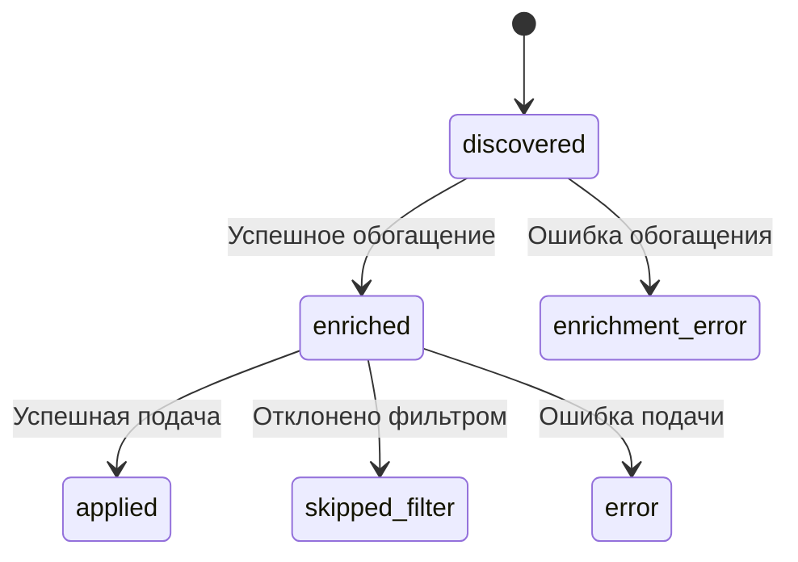

# Схема базы данных

Проект использует **SQLite** в качестве легковесной и простой в использовании реляционной базы данных. Вся информация о вакансиях и истории запусков хранится в файле `jobs.db`.

## Таблица `vacancies`

Это основная таблица, в которой хранится вся информация о найденных вакансиях и их текущем состоянии.

- **Назначение:** Отслеживание жизненного цикла каждой вакансии от момента обнаружения до подачи заявки или отклонения.

- **Структура полей:**

| Поле | Тип | Описание |
| :--- | :--- | :--- |
| `id` | INTEGER, PRIMARY KEY | Уникальный идентификатор вакансии из LinkedIn. |
| `title` | TEXT | Название должности. |
| `company` | TEXT | Название компании. |
| `link` | TEXT | Прямая ссылка на страницу вакансии. |
| `status` | TEXT | **Ключевое поле**, отражающее текущий этап обработки. |
| `created_at` | TIMESTAMP | Дата и время добавления записи в БД. |
| `description` | TEXT | Полное описание вакансии (HTML или текст). |
| `company_description` | TEXT | Описание компании. |
| `seniority_level` | TEXT | Уровень сеньорности (Junior, Mid, Senior, etc.). |
| `employment_type` | TEXT | Тип занятости (Full-time, Part-time, Contract, etc.). |
| `job_function` | TEXT | Функциональная область (Engineering, Marketing, etc.). |
| `industries` | TEXT | Индустрии компании. |
| `company_overview` | TEXT | Обзор компании. |
| `company_website` | TEXT | Сайт компании. |
| `company_industry` | TEXT | Индустрия компании. |
| `company_size` | TEXT | Размер компании (сотрудники). |
| `match_percentage` | INTEGER | Процент соответствия, рассчитанный LLM (0-100). |
| `analysis` | TEXT | Обоснование оценки от LLM. |

### Жизненный цикл статуса (`status`)

Поле `status` является центральным для управления потоком работы бота. Вакансия последовательно проходит через следующие состояния:

1.  **`discovered`**: Начальный статус. Вакансия найдена в результатах поиска, и ее ссылка сохранена в БД.
2.  **`enrichment_error`**: Статус, присваиваемый, если бот не смог получить детальную информацию о вакансии на фазе `Enrichment`.
3.  **`enriched`**: Вакансия успешно "обогащена". Бот собрал всю необходимую информацию (описание, детали компании и т.д.), и она готова к обработке.
4.  **`skipped_filter`**: Вакансия была отклонена на фазе `Processing` либо интеллектуальным LLM-фильтром, либо резервным фильтром по ключевым словам.
5.  **`error`**: Произошла непредвиденная ошибка в процессе подачи заявки (например, изменилась структура формы).
6.  **`applied`**: Заявка на вакансию была успешно подана. Это финальный успешный статус.

## Таблица `run_history`

- **Назначение:** Хранение информации о времени последних успешных запусков бота. Используется для мониторинга и статистики. **Примечание:** В текущей версии НЕ используется для расчета периода поиска (используется параметр `JOB_SEARCH_PERIOD_SECONDS` из конфигурации).

- **Структура полей:**

| Поле | Тип | Описание |
| :--- | :--- | :--- |
| `id` | INTEGER, PRIMARY KEY | Автоинкремент ID записи. |
| `run_timestamp`| TIMESTAMP | Дата и время успешного завершения работы бота. |

---

## Дополнительная информация

- [Архитектура проекта](architecture.md)
- [Описание компонентов](components.md)
- [Структура проекта](project-structure.md)
- [Руководство по началу работы](getting-started.md)
