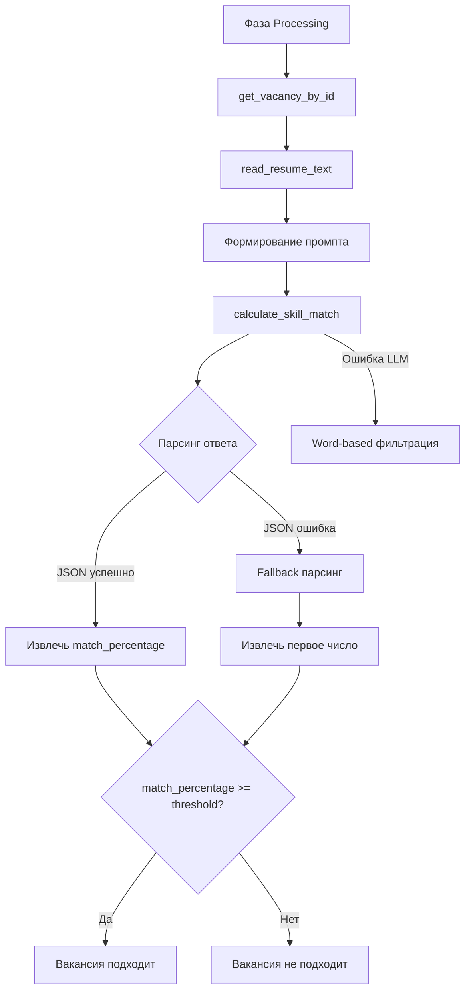
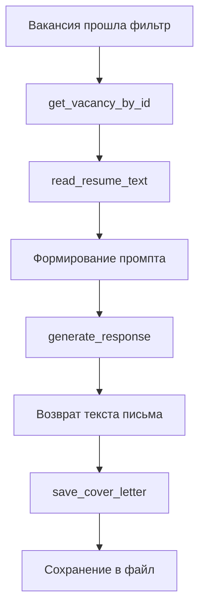

# 🤖 Интеграция с LLM (Большими Языковыми Моделями)

Этот документ описывает архитектуру и принципы работы модуля интеграции с Большими Языковыми Моделями (LLM) в проекте **LinkedIn Easy Apply Bot**. Модуль `llm/` выводит бота на новый уровень, заменяя простую фильтрацию по ключевым словам интеллектуальным анализом.

---

## 📋 Содержание

1. [Обзор](#обзор)
2. [Архитектура модуля](#архитектура-модуля)
3. [Процесс фильтрации вакансий](#процесс-фильтрации-вакансий)
4. [Генерация сопроводительных писем](#генерация-сопроводительных-писем)
5. [Конфигурация LLM](#конфигурация-llm)
6. [Промпты](#промпты)
7. [Интеграция с проектом](#интеграция-с-проектом)
8. [Используемые библиотеки](#используемые-библиотеки)
9. [Безопасность и масштабируемость](#безопасность-и-масштабируемость)
10. [Известные ограничения](#известные-ограничения)

---

## Обзор

### Требования к интеграции LLM

#### 1. Автоматическая фильтрация вакансий
- Анализ соответствия навыков и опыта из резюме требованиям вакансии
- Расчет процента совпадения навыков (`match_percentage`)
- Сравнение с пороговым значением из конфигурации
- Использование информации о вакансии из базы данных
- **Стандартный механизм фильтрации**: через LLM
- **Fallback**: Автоматический откат на word-based фильтрацию при ошибке LLM

#### 2. Генерация сопроводительных писем
- Использование информации о вакансии из базы данных
- Использование текста резюме пользователя (из txt-файла)
- Генерация персонализированных сопроводительных писем

---

## Архитектура модуля

### Структура директории `llm/`

```
llm/
├── __init__.py
├── client_factory.py        # Синглтон-фабрика LLM-клиента (LRU-кеш)
├── config.py                # Pydantic Settings для конфигурации LLM
├── cover_letter_generator.py # Генерация сопроводительных писем
├── exceptions.py            # Исключения LLM-подсистемы
├── llm_client.py            # Универсальный клиент для провайдеров LLM
├── prompts.py               # Шаблоны промптов для LLM
├── resume_utils.py          # Утилиты для чтения резюме
└── vacancy_filter.py        # Фильтрация вакансий с использованием LLM
```

### Роли модулей

#### `llm_client.py`
**Класс:** `LLMClient`  
**Назначение:** Единый интерфейс поверх провайдеров OpenAI, Ollama, Anthropic

**Основной метод:**
```python
async def generate_response(
    self,
    prompt: str,
    temperature: float = 0.0
) -> str
```

#### `client_factory.py`
**Функция:** `get_llm_client()`  
**Назначение:** Синглтон через `lru_cache` для повторного использования клиента

```python
@lru_cache(maxsize=1)
def get_llm_client() -> LLMClient:
    settings = LLMSettings()
    return LLMClient(settings)
```

#### `config.py`
**Класс:** `LLMSettings`  
**Назначение:** Типобезопасная конфигурация через Pydantic

**Параметры:**
- `LLM_PROVIDER`: "openai" | "ollama" | "anthropic"
- `LLM_MODEL`: Имя модели
- `LLM_API_KEY`: API-ключ (обязателен для OpenAI/Anthropic)
- `LLM_BASE_URL`: URL для локальных моделей (Ollama)
- `LLM_THRESHOLD_PERCENTAGE`: Порог совпадения (0-100)
- `LLM_TIMEOUT`: Таймаут запросов (по умолчанию 60)
- `LLM_MAX_RETRIES`: Максимальное число ретраев (по умолчанию 3)
- `LLM_TEMPERATURE`: Температура выборки (по умолчанию 0.0)
- Профиль кандидата: `ModalFlowConfig.profile_path` (по умолчанию `config/profile_example.json`)

#### `prompts.py`
**Назначение:** Шаблоны промптов для LLM

**Промпты:**
- `VACANCY_MATCH_PROMPT`: Для фильтрации вакансий
- `COVER_LETTER_PROMPT`: Для генерации писем

#### `vacancy_filter.py`
**Функции:**
- `calculate_skill_match()`: Вызов LLM для расчета совпадения
- `is_vacancy_suitable()`: Публичный API для фильтрации

#### `cover_letter_generator.py`
**Функции:**
- `generate_cover_letter()`: Генерация письма
- `save_cover_letter()`: Сохранение письма в файл

#### `resume_utils.py`
**Функция:** `read_resume_text()`  
**Назначение:** Загрузка профиля кандидата из JSON (`ModalFlowConfig.profile_path`) и подготовка данных для промптов

#### `exceptions.py`
**Исключения:**
- `LLMError`: Базовое исключение
- `VacancyNotFoundError`: Вакансия не найдена
- `ResumeReadError`: Ошибка загрузки профиля
- `LLMGenerationError`: Ошибка генерации LLM
- `CoverLetterGenerationError`: Ошибка генерации письма
- `CoverLetterSaveError`: Ошибка сохранения письма

---

## Процесс фильтрации вакансий

### Поток обработки



### 1. Получение данных
- Получение вакансии из БД: `get_vacancy_by_id()`
- Чтение резюме: `read_resume_text()`

### 2. Формирование промпта
На основе шаблона `VACANCY_MATCH_PROMPT` и данных вакансии/резюме

### 3. Вызов LLM
```python
client = get_llm_client()
response = await client.generate_response(prompt)
```

### 4. Парсинг ответа
**Ожидается JSON:**
```json
{
  "match_percentage": 85,
  "analysis": "Кандидат имеет сильное соответствие..."
}
```

**Устойчивый парсинг:**
- При ошибке парсинга JSON извлекается первое число регулярным выражением
- Весь текст используется как анализ

### 5. Принятие решения
Сравнение `match_percentage` с `LLM_THRESHOLD_PERCENTAGE`

### Логирование и метрики

В `calculate_skill_match()` логируются:
- `provider`, `model`
- `latency_ms`, `retries_count`
- Статус: "success" | "json_parse_error" | "fallback_parse_success" | "fallback_parse_failed"

В `is_vacancy_suitable()` логируются:
- `match_percentage`, `analysis`
- `is_suitable`, `threshold`
- Статусы жизненного цикла

### Обработка исключений

- `VacancyNotFoundError`, `ResumeReadError` → прокидываются наверх
- Другие исключения → логируются с контекстом и прокидываются
- **Fallback**: В фазе Processing автоматический откат на word-based фильтрацию

---

## Генерация сопроводительных писем

### Поток выполнения



### 1. Получение информации
- Информация о вакансии: `get_vacancy_by_id()`
- Текст резюме: `read_resume_text()`

### 2. Формирование промпта
На основе шаблона `COVER_LETTER_PROMPT`

### 3. Генерация текста
```python
letter = await generate_cover_letter(vacancy_id)
```

### 4. Сохранение результата
```python
save_cover_letter(vacancy_id, letter_text)
# Сохраняется в: generated_letters/cover_letter_{vacancy_id}.docx
```

### Обработка исключений

- `VacancyNotFoundError`, `ResumeReadError`, `LLMGenerationError` → прокидываются
- Общие ошибки → оборачиваются в `CoverLetterGenerationError`
- Ошибки сохранения → `CoverLetterSaveError`

---

## Конфигурация LLM

Конфигурация задается через переменные окружения (файл `.env`):

```env
# Провайдер
LLM_PROVIDER="ollama"           # "openai" | "ollama" | "anthropic"
LLM_MODEL="qwen3:8b"            # Имя модели провайдера

# Параметры фильтрации
LLM_THRESHOLD_PERCENTAGE=70     # Порог совпадения (0-100)

# Аутентификация
LLM_API_KEY=""                  # API-ключ (обязателен для openai/anthropic)
LLM_BASE_URL="http://localhost:11434"  # URL для Ollama

# Параметры запросов
LLM_TIMEOUT=60                  # Таймаут запросов (секунды)
LLM_MAX_RETRIES=3               # Максимальное число ретраев
LLM_TEMPERATURE=0.0             # Температура выборки (0.0 = детерминированно)
```

> Профиль кандидата загружается из `ModalFlowConfig.profile_path` (по умолчанию `config/profile_example.json`). Обновите этот JSON, чтобы LLM использовал свежие данные.

### Валидации

В `LLMSettings`:
- Диапазон порога совпадения: 0-100
- Требование `LLM_API_KEY` для "openai"/"anthropic"
- Проверка корректности значений

### Поддерживаемые провайдеры

#### OpenAI
```env
LLM_PROVIDER="openai"
LLM_MODEL="gpt-4-turbo"
LLM_API_KEY="sk-..."
```

#### Ollama (локальный)
```env
LLM_PROVIDER="ollama"
LLM_MODEL="qwen3:8b"
LLM_BASE_URL="http://localhost:11434"
```

#### Anthropic
```env
LLM_PROVIDER="anthropic"
LLM_MODEL="claude-3-opus-20240229"
LLM_API_KEY="sk-ant-..."
```

---

## Промпты

Файл `prompts.py` играет центральную роль - содержит "инструкции" для LLM.

### VACANCY_MATCH_PROMPT

Инструктирует модель проанализировать вакансию и резюме, вернуть JSON:

```python
VACANCY_MATCH_PROMPT = """
Analyze the following job vacancy and candidate's resume.

Job Details:
- Title: {title}
- Company: {company}
- Description: {description}

Candidate's Resume:
{resume}

Provide your assessment as JSON with:
- match_percentage (0-100)
- analysis (brief explanation)
"""
```

### COVER_LETTER_PROMPT

Просит модель написать персонализированное сопроводительное письмо:

```python
COVER_LETTER_PROMPT = """
Write a professional cover letter for the following job application.

Job Details:
- Title: {title}
- Company: {company}
- Description: {description}

Candidate's Resume:
{resume}

Generate a personalized cover letter highlighting relevant skills.
"""
```

---

## Интеграция с проектом

### Изменения в `phases/processing.py`

#### Функция `_is_job_suitable()`

```python
def _is_job_suitable(job: dict) -> bool:
    """
    Проверяет подходит ли вакансия.
    
    Стандартная проверка через LLM.
    При ошибке - fallback на word-based фильтрацию.
    """
    try:
        # Основная фильтрация через LLM
        return is_vacancy_suitable(job['id'])
    except Exception as e:
        logger.warning(f"LLM фильтрация не удалась: {e}")
        # Fallback на word-based фильтрацию
        return _word_based_filter(job)
```

#### Функция `run_processing_phase()`

```python
async def run_processing_phase(...):
    for job in enriched_jobs:
        if _is_job_suitable(job):
            # Генерация сопроводительного письма
            letter = await generate_cover_letter(job['id'])
            save_cover_letter(job['id'], letter)
            
            # Подача заявки
            await apply_to_job(page, job, letter_path)
        else:
            update_job_status(job['id'], 'skipped_filter')
```

### Изменения в `main.py`

Никаких архитектурных изменений не требуется. Оркестратор вызывает `run_processing_phase()` как прежде.

---

## Используемые библиотеки

### LLM-провайдеры
```toml
langchain-openai = "^0.1.0"
langchain-community = "^0.2.0"
langchain-anthropic = "^0.1.0"
```

### Конфигурация
```toml
pydantic = "^2.0.0"
pydantic-settings = "^2.0.0"
python-dotenv = "^1.0.0"  # опционально
```

### Другие
```toml
langdetect = "^1.0.9"      # для fallback-фильтра
playwright = "^1.40.0"      # браузерная автоматизация
```

### Примечания по провайдерам

- **OpenAI/Anthropic**: Требуют API-ключ; проверка в `LLMSettings`
- **Ollama**: Использует локальный runtime по адресу `LLM_BASE_URL`

---

## Безопасность и масштабируемость

### Безопасность

1. **API-ключи через переменные окружения**
   - Не хранятся в коде
   - Загружаются из `.env` файла

2. **Pydantic Settings**
   - Строгая валидация конфигурации
   - Проверка типов и диапазонов

3. **Таймауты и ретраи**
   - Предотвращение зависаний
   - Настраиваемые лимиты

### Масштабируемость и надежность

1. **Поддержка нескольких провайдеров**
   - Единый интерфейс `LLMClient`
   - Легкое переключение между провайдерами

2. **Ретраи**
   - OpenAI/Anthropic: встроенные в клиент
   - Ollama: через `.with_retry()`

3. **LRU-кэш клиента**
   - `get_llm_client()` снижает накладные расходы
   - Стабилизирует поведение

4. **Fallback-наблюдаемость**
   - Статусная модель логирования
   - Упрощает диагностику качества ответов LLM

---

## Известные ограничения

### Текущие особенности

1. **Ответ LLM может не соответствовать JSON-формату**
   - Включен устойчивый парсер
   - Извлекает первое число как процент
   - Может давать консервативные оценки

2. **Вакансии без описания автоматически пропускаются**

3. **Word-based фильтрация** 
   - Только как автоматический fallback при исключениях LLM
   - Не управляется конфигурационным флагом

### Рекомендуемые улучшения

1. **Конфигурационный переключатель**
   - Явный выбор режима (LLM/word-based/гибрид)

2. **Строгая валидация LLM-ответов**
   - Указание схемы
   - Переспрашивание при ошибке

3. **Кэширование результатов LLM**
   - На уровне задач
   - Снижение стоимости и задержек

4. **Расширенные метрики**
   - Доля fallback
   - Распределение latency
   - Доля JSON-ошибок

5. **Асинхронная/пакетная обработка**
   - Для высоких нагрузок
   - Параллельная обработка вакансий

---

## Ссылки на основные элементы реализации

### Фильтрация
- `is_vacancy_suitable()` - публичный API
- `calculate_skill_match()` - вызов LLM

### Генерация писем
- `generate_cover_letter()` - генерация
- `save_cover_letter()` - сохранение

### Клиент
- `LLMClient` - универсальный клиент
- `generate_response()` - основной метод

### Конфигурация
- `LLMSettings` - Pydantic модель
- `get_llm_client()` - фабрика клиента

### Интеграция
- `_is_job_suitable()` - в `phases/processing.py`
- `run_processing_phase()` - оркестрация

---

## Дополнительная информация

- [Архитектура проекта](architecture.md)
- [Описание компонентов](components.md)
- [Руководство по началу работы](getting-started.md)
- [Workflow и поток данных](workflow.md)
- [Схема базы данных](database-schema.md)
- [Тестирование](testing.md)
- [Руководство по контрибьюции](contribution-guide.md)
