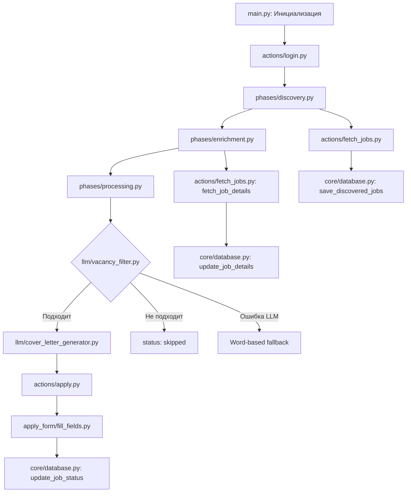

# 📁 Структура проекта LinkedIn Easy Apply Bot

Этот документ описывает техническую архитектуру, внутреннее устройство и структуру тестов проекта **LinkedIn Easy Apply Bot**.

---

## 📋 Содержание

1. [Введение](#введение)
2. [Архитектура и структура директорий](#архитектура-и-структура-директорий)
3. [Описание модулей](#описание-модулей)
4. [База данных](#база-данных)
5. [Бизнес-логика](#бизнес-логика)
6. [Структура тестовой системы](#структура-тестовой-системы)
7. [Рекомендации по тестированию](#рекомендации-по-тестированию)

---

## Введение

Проект **LinkedIn Easy Apply Bot** автоматизирует процесс поиска и подачи заявок на вакансии в LinkedIn, используя технологию "Easy Apply".

### Основные этапы работы бота

1. **Обнаружение (Discovery)**: Поиск новых вакансий по заданным критериям
2. **Обогащение (Enrichment)**: Сбор подробной информации о найденных вакансиях
3. **Обработка (Processing)**: Фильтрация и подача заявок на подходящие вакансии

### Технологический стек

- **Python 3.7+**
- **Playwright** для автоматизации браузера
- **SQLite** для хранения данных
- **LLM** (OpenAI, Ollama, Anthropic) для интеллектуальной фильтрации и генерации ответов
- **Langdetect** для определения языка (fallback фильтр)
- **Pydantic** для конфигурации
- **Pytest** для тестирования

---

## Архитектура и структура директорий

Проект имеет модульную структуру с четким разделением ответственности:

```
.
├── actions/                # Основные действия (login, fetch, apply)
│   ├── apply.py            # Логика подачи заявки (entry point)
│   ├── fetch_jobs.py       # Сбор ссылок и деталей вакансий
│   └── login.py            # Логика входа в LinkedIn
│
├── apply_form/             # (Legacy) Модули для жесткого заполнения полей
│   ├── fill_fields.py      # Оркестратор заполнения полей
│   ├── fill_boolean.py     # Заполнение чекбоксов
│   ├── fill_text_fields.py # Заполнение текстовых полей
│   ├── fill_multiple_choice_fields.py
│   ├── insert_phone.py
│   ├── insert_home_city.py
│   ├── upload_docs.py
│   ├── uncheck_follow_company.py
│   ├── click_next_button.py
│   └── wait_for_no_error.py
│
├── config/                 # Файлы конфигурации
│   ├── rules.yaml          # Правила для modal_flow
│   └── profile_example.json # Пример профиля кандидата
│
├── core/                   # Ядро проекта
│   ├── form_filler/        # Адаптеры заполнения форм (Bridge к modal_flow)
│   ├── database.py         # Взаимодействие с базой данных SQLite
│   ├── logger.py           # Настройка логирования (structlog)
│   ├── selectors.py        # CSS-селекторы для элементов на страницах
│   ├── utils.py            # Вспомогательные функции
│   ├── metrics.py          # Сбор метрик производительности
│   └── resilience.py       # Circuit breaker и retry логика
│
├── diagnostics/            # Подсистема диагностики и сбора артефактов
│   ├── capture.py          # Логика захвата (скриншоты, HTML)
│   ├── har.py              # Захват сетевой активности (HAR)
│   ├── masking.py          # Маскировка PII данных
│   ├── storage.py          # Управление файлами артефактов
│   └── ...
│
├── llm/                    # Модуль для интеграции с LLM (AI)
│   ├── client_factory.py   # Фабрика для создания LLM-клиента
│   ├── config.py           # Конфигурация LLM
│   ├── llm_client.py       # Клиент для работы с LLM-провайдерами
│   ├── vacancy_filter.py   # Фильтрация вакансий через LLM
│   ├── cover_letter_generator.py  # Генерация писем
│   ├── prompts.py          # Шаблоны промптов
│   ├── schemas.py          # Pydantic схемы
│   ├── resume_utils.py     # Работа с резюме
│   └── exceptions.py       # Исключения LLM-модуля
│
├── modal_flow/             # Новая система адаптивного заполнения форм
│   ├── modal_flow.py       # Главный оркестратор (Runner)
│   ├── rules_engine.py     # Движок правил для ответов
│   ├── document_upload.py  # Загрузка резюме и документов
│   ├── normalizer.py       # Нормализация вопросов
│   └── ...
│
├── phases/                 # Основные фазы работы бота
│   ├── discovery.py        # Фаза поиска вакансий
│   ├── enrichment.py       # Фаза сбора детальной информации
│   └── processing.py       # Фаза фильтрации и подачи заявок
│
├── tests/                  # Тесты (unit и integration)
│   ├── conftest.py         # Общие фикстуры
│   ├── fixtures/           # HTML-файлы для тестов
│   ├── unit/               # Unit-тесты
│   │   ├── actions/
│   │   ├── apply_form/
│   │   ├── core/
│   │   ├── diagnostics/
│   │   ├── llm/
│   │   ├── modal_flow/
│   │   └── phases/
│   └── integration/        # Интеграционные тесты
│       ├── conftest.py
│       ├── test_database_flow.py
│       ├── test_phases_flow.py
│       ├── test_scraping_logic.py
│       └── test_workflow_integration.py
│
├── docs/                   # Документация
├── memory-bank/            # Memory Bank (отдельная система)
├── main.py                 # Точка входа в приложение
├── config.py               # Основной файл конфигурации (AppConfig)
├── jobs.db                 # База данных SQLite
└── pyproject.toml          # Зависимости и конфигурация проекта
```

---

## Описание модулей

### `main.py` - Главный оркестратор

**Назначение:** Точка входа в приложение

**Логика:**
1. Настраивает логирование (`core/logger.py`)
2. Инициализирует базу данных (`core/database.py`)
3. Проверяет лимиты.
4. Запускает `playwright` и создает контекст браузера.
5. Выполняет вход в LinkedIn (`actions/login.py`).
6. Последовательно запускает фазы в зависимости от `BOT_MODE` (`discovery`, `enrichment`, `processing`).
7. Управляет глобальной обработкой ошибок и диагностикой.
8. Закрывает контекст браузера

---

### `config.py` - Конфигурация

**Назначение:** Централизованное хранение всех настроек (класс `AppConfig`).
Включает параметры для: LinkedIn credentials, поиска, LLM, регулярных выражений, путей к файлам, диагностики, метрик и resilience.

---

### `diagnostics/` - Подсистема диагностики

**Назначение:** Сбор артефактов при ошибках для упрощения отладки.

**Ключевые компоненты:**
- `capture.py`: Основная точка входа для захвата состояния страницы.
- `har.py` / `trace.py`: Захват сетевых логов и трейсов Playwright.
- `masking.py`: Удаление чувствительной информации (PII) из логов и HTML.
- `storage.py`: Управление ротацией файлов и лимитами дискового пространства.

---

### `modal_flow/` - Адаптивное заполнение форм

**Назначение:** Интеллектуальная система заполнения форм "Easy Apply", способная адаптироваться к разным типам вопросов без жесткого кодирования.

**Ключевые компоненты:**
- `modal_flow.py`: Управляет переходом между шагами модального окна.
- `rules_engine.py`: Выбирает ответ на основе предопределенных правил или LLM.
- `normalizer.py`: Приводит текст вопросов к стандартному виду для поиска правил.
- `document_upload.py`: Управляет загрузкой резюме и генерацией Cover Letter "на лету".

---

### Директория `core/`

#### `form_filler/`
Связующее звено между старой архитектурой и новой системой `modal_flow`. Позволяет прозрачно использовать новую логику заполнения форм.

#### `database.py`
**Назначение:** Работа с SQLite (`jobs.db`).
- CRUD операции для вакансий.
- Управление статусами (`discovered`, `enriched`, `applied`, etc.).
- История запусков.

**Ключевые функции:**
- `setup_database()`: Создает таблицы если не существуют
- `save_discovered_jobs()`: Сохраняет найденные вакансии
- `get_discovered_jobs()`: Извлекает вакансии со статусом `discovered`
- `update_job_details()`: Обновляет запись после Enrichment
- `get_enriched_jobs()`: Извлекает вакансии со статусом `enriched`
- `update_job_status()`: Обновляет статус (`applied`, `skipped`, etc.)
- `get_vacancy_by_id()`: Получает вакансию по ID
- `record_run_timestamp()`: Записывает время запуска
- `get_last_run_timestamp()`: Получает последний запуск

#### `selectors.py`
**Назначение:** Централизация CSS-селекторов

**Преимущества:**
- Отделение логики от представления
- Легкость обновления при изменении UI LinkedIn

#### `logger.py`
**Назначение:** Настройка структурированного логирования

**Функциональность:**
- Использует `structlog` для structured logging
- Поддерживает JSON и консольный вывод
- Контекст-биндинг для логов
- `get_structured_logger()` - фабрика логгера

#### `utils.py`
**Назначение:** Вспомогательные функции

**Функции:**
- `wait()`: Случайные задержки для имитации человека
- `wait_for_any_selector()`: Параллельное ожидание селекторов
- `check_any_selector_present()`: Мгновенная проверка элементов

#### `metrics.py`
**Назначение:** Сбор метрик производительности

**Класс:** `MetricsCollector`
- Thread-safe сбор метрик
- Расчет P95 latency
- JSON экспорт метрик
- Singleton pattern

#### `resilience.py`
**Назначение:** Устойчивость к сбоям.
- `CircuitBreakerListener`, `SelectorExecutor`, `ResilienceExecutor`.
- Обеспечивает ретраи и остановку работы при частых сбоях (Circuit Breaker).

**Классы:**
- `CircuitBreakerListener`: Мониторинг состояния
- `SelectorCircuitBreaker`: Менеджер circuit breaker
- `SelectorExecutor`: Комбинация retry + circuit breaker для селекторных операций
- `ResilienceExecutor`: Универсальный executor для всех типов операций:
    - Делегирует селекторные операции к SelectorExecutor
    - `navigate()`: Навигация с ретраями
    - `extract_text_with_retry()`: Извлечение текста с ретраями и скроллингом
    - `execute_workflow_with_retry()`: Workflow-операции с cleanup между попытками
    - `query_selector_with_retry()`: DOM-запросы с ретраями
- 10 convenience методов (click, fill, check, etc.) через делегирование

---

### Директория `phases/`

1. **`discovery.py`**: Поиск вакансий и сохранение ссылок.
2. **`enrichment.py`**: Переход по ссылкам и сбор полного описания.
3. **`processing.py`**: Фильтрация (LLM/Keyword), генерация писем и подача заявок.

#### `discovery.py`
**Назначение:** Фаза поиска

**Логика:**
- Вызывает `actions.fetch_jobs.fetch_job_links_user()`
- Сохраняет результат в БД со статусом `discovered`
- Валидация периода поиска
- Backward compatibility fallback

#### `enrichment.py`
**Назначение:** Фаза обогащения

**Логика:**
- Получает `discovered` вакансии из БД
- Для каждой собирает детальную информацию
- Обновляет запись в БД со статусом `enriched`

#### `processing.py`
**Назначение:** Фаза подачи заявок (самая сложная)

**Логика:**
- Получает `enriched` вакансии из БД
- **Фильтрация через LLM**: `llm.vacancy_filter.is_vacancy_suitable()`
- **Fallback на word-based** при ошибке LLM
- Неподходящие → статус `skipped`
- Для подходящих:
  - Генерирует письмо: `llm.cover_letter_generator.generate_cover_letter()`
  - Подает заявку: `actions.apply.apply_to_job()`
  - В режиме `SUBMIT` → статус `applied`

---

### Директория `actions/`

#### `login.py`
**Назначение:** Управление входом в LinkedIn

**Логика:**
1. Открывает страницу входа
2. Вводит email и пароль
3. Нажимает кнопку "Sign in"
4. Обрабатывает CAPTCHA и 2FA (ожидает ручного ввода)

#### `fetch_jobs.py`
**Назначение:** Поиск и сбор вакансий

**Логика:**
1. Формирует URL поиска на основе параметров
2. Прокручивает страницу для загрузки всех вакансий
3. Собирает ссылки на вакансии "Easy Apply"
4. Открывает страницы вакансий для детальной информации

#### `apply.py`
**Назначение:** Подача заявки

**Логика:**
1. Переходит на страницу вакансии
2. Нажимает кнопку "Easy Apply"
3. Вызывает `apply_form.fill_fields.run()` для заполнения
4. В режиме `SUBMIT` нажимает "Submit application"

---

### Директория `apply_form/`

**Назначение:** Заполнение форм "Easy Apply"

#### `fill_fields.py`
Главный оркестратор - итерируется по полям и вызывает специализированные обработчики

#### Специализированные модули:
- `fill_text_fields.py`: Текстовые поля
- `fill_boolean.py`: Чекбоксы и radio buttons
- `fill_multiple_choice_fields.py`: Выпадающие списки
- `insert_phone.py`: Телефон
- `insert_home_city.py`: Город
- `upload_docs.py`: Загрузка резюме
- `uncheck_follow_company.py`: Снятие галочки "Follow company"
- `click_next_button.py`: Кнопка "Next/Review"
- `wait_for_no_error.py`: Ожидание исчезновения ошибок

---

### Директория `llm/`

Подробно описан в [LLM Integration](llm-integration.md)

**Основные компоненты:**
- `llm_client.py`: Универсальный клиент (OpenAI, Ollama, Anthropic)
- `vacancy_filter.py`: Фильтрация вакансий
- `cover_letter_generator.py`: Генерация писем
- `prompts.py`: Шаблоны промптов
- `config.py`: Pydantic конфигурация

---

## База данных

**СУБД:** SQLite  
**Файл:** `jobs.db`

### Таблица `vacancies`

**Назначение:** Хранение информации о вакансиях

**Структура:**
- `id` (INTEGER, PRIMARY KEY): ID вакансии из LinkedIn
- `title` (TEXT): Название вакансии
- `company` (TEXT): Название компании
- `link` (TEXT): Ссылка на вакансию
- `status` (TEXT): Текущий статус
- `description` (TEXT): Описание вакансии
- `location` (TEXT): Местоположение
- `created_at` (TIMESTAMP): Дата создания записи
- `updated_at` (TIMESTAMP): Дата обновления записи

**Статусы:**
- `discovered`: Найдена, ждет обогащения
- `enriched`: Обогащена данными, ждет обработки
- `applied`: Заявка подана успешно
- `skipped_filter`: Пропущена фильтром
- `error`: Ошибка при обработке
- `enrichment_error`: Ошибка при обогащении

### Таблица `run_history`

**Назначение:** Хранение временных меток успешных запусков

**Использование:**
- Мониторинг и статистика
- НЕ используется для расчета периода поиска
- Полезна для будущей аналитики

---

## Бизнес-логика

### Основной сценарий (Full Run)

1. **Login**: Вход в систему.
2. **Discovery**: Сбор ссылок -> БД (`discovered`).
3. **Enrichment**: Чтение `discovered` -> Сбор деталей -> БД (`enriched`).
4. **Processing**:
   - Чтение `enriched`.
   - Фильтрация (LLM или слова).
   - Если подходит: Генерация CL -> Подача заявки (`modal_flow`) -> БД (`applied`).
   - Если нет: БД (`skipped`).



### Режимы работы

**`BOT_MODE` в `config.py`:**

1. **`discovery`**: Только поиск и сохранение ссылок
2. **`enrichment`**: Поиск + обогащение деталями
3. **`processing`**: Только обработка уже обогащенных вакансий
4. **`full_run`**: Все три фазы последовательно
---

## Структура тестовой системы

### Общая структура

Тестовая система состоит из unit-тестов и интеграционных тестов с использованием pytest.

```
tests/
├── conftest.py                    # Общие фикстуры
├── fixtures/                      # HTML-файлы для тестов
│   ├── sample_search_page.html
│   ├── sample_job_page.html
│   └── sample_company_page.html
├── unit/                          # Unit-тесты
│   ├── actions/
│   │   ├── test_apply.py
│   │   ├── test_login.py
│   │   └── test_fetch_jobs.py
│   ├── apply_form/
│   │   ├── test_fill_fields.py
│   │   ├── test_fill_boolean.py
│   │   ├── test_fill_text_fields.py
│   │   └── ...
│   ├── core/
│   │   ├── test_database_unit.py
│   │   ├── test_utils.py
│   │   ├── test_metrics.py
│   │   └── test_resilience.py
│   └── phases/
│       ├── test_discovery.py
│       ├── test_enrichment.py
│       └── test_processing_logic.py
└── integration/
    ├── conftest.py
    ├── test_database_flow.py      # Потоки работы с БД
    ├── test_phases_flow.py         # Потоки выполнения фаз
    ├── test_scraping_logic.py      # Логика скрэпинга
    └── test_workflow_integration.py # Полный рабочий процесс
```

### Основные фикстуры (`tests/conftest.py`)

#### `db_connection`
Создает in-memory SQLite базу данных для каждого теста:

```python
class MockConnectionWrapper:
    """Wrapper вокруг реального sqlite3 соединения."""
    def __init__(self, real_conn):
        self._real_conn = real_conn
    
    def close(self):
        # Не закрываем преждевременно
        pass
    
    def __getattr__(self, name):
        return getattr(self._real_conn, name)

@pytest.fixture
def db_connection():
    real_conn = sqlite3.connect(":memory:")
    mock_conn_wrapper = MockConnectionWrapper(real_conn)
    
    with patch('core.database.sqlite3.connect', return_value=mock_conn_wrapper):
        database.setup_database()
        yield mock_conn_wrapper
    
    real_conn.close()
```

### Unit-тесты

**Уровень:** Изолированные проверки отдельных функций

**Инструменты:** pytest, unittest.mock

**Примеры:**
- `test_fill_fields.py`: Логика заполнения полей
- `test_database_unit.py`: Функции работы с БД
- `test_processing_logic.py`: Логика обработки фаз
- `test_utils.py`: Новые утилиты (wait_for_any_selector, etc.)
- `test_metrics.py`: Сбор метрик
- `test_resilience.py`: Circuit breaker и retry

### Интеграционные тесты

**Уровень:** Взаимодействие компонентов, API, БД

**Инструменты:** pytest, playwright.sync_api, фикстуры

**Примеры:**
- `test_scraping_logic.py`: Логика скрэпинга данных
- `test_database_flow.py`: Потоки работы с БД
- `test_phases_flow.py`: Потоки выполнения фаз
- `test_workflow_integration.py`: Полный рабочий процесс

**Особенности:**
- Используют синхронный API Playwright (после решения конфликта плагинов)
- Используют HTML-файлы из `fixtures/` для симуляции страниц LinkedIn

### Конфигурация pytest (`pyproject.toml`)

```toml
[tool.pytest.ini_options]
asyncio_mode = "auto"
addopts = "-v --disable-warnings"
python_files = "test_*.py"
python_classes = "Test*"
python_functions = "test_*"
testpaths = ["tests/unit"]
markers = [
    "unit: marks tests as unit tests",
    "integration: marks tests as integration tests"
]
```
### Используемые плагины

- **pytest-asyncio**: Для асинхронных тестов
- **pytest-playwright**: Для браузерной автоматизации
- **pytest-mock**: Для создания mock-объектов

---

## Рекомендации по тестированию

1. **Unit-тесты**: Покрывают отдельные функции и классы. Особенно важны для `modal_flow` (правила) и `llm` (фильтрация).
2. **Интеграционные тесты**: Проверяют цепочки вызовов и работу с реальной (in-memory) БД.
3. **Мокирование**:
   - `playwright.async_api.Page` - мокируется почти везде.
   - `LLMClient` - мокируется для детерминированности тестов.

### Unit-тесты

**Рекомендуемые области покрытия:**

1. **`core/database.py`**: CRUD-операции с in-memory SQLite
2. **`phases/processing.py`**: Функция `_is_job_suitable` (LLM + fallback)
3. **`llm/`**:
   - `vacancy_filter.py`: Тестирование с мокированием `LLMClient`
   - `llm_client.py`: Инициализация клиента по провайдеру
4. **`apply_form`**: Каждый обработчик с мокированием `playwright.Page`
5. **`core/utils.py`**: Новые оптимизированные функции
6. **`core/metrics.py`**: Сбор и экспорт метрик
7. **`core/resilience.py`**: Circuit breaker логика

### Интеграционные тесты

**Рекомендуемые сценарии:**

1. **Взаимодействие фаз**: Переход вакансии по статусам  
   `discovered` → `enriched` → `applied`/`skipped`
2. **LLM + phases**: Fallback на word-based при сбое LLM

3. **Database flows**: Полный жизненный цикл вакансии в БД

### E2E тесты

**Подход:**
- Полный E2E тест на тестовом аккаунте LinkedIn дорог и хрупок
- Фокус на unit- и интеграционных тестах
- E2E только для критических путей

### Что мокировать

- **`playwright.async_api.Page`**: В большинстве тестов
- **`llm.llm_client.LLMClient`**: При тестировании логики, зависящей от LLM
- **`core.database`**: При тестировании логики фаз

---

## Дополнительная информация

- [Архитектура проекта](architecture.md)
- [Описание компонентов](components.md)
- [Интеграция с LLM](llm-integration.md)
- [Workflow и поток данных](workflow.md)
- [Схема базы данных](database-schema.md)
- [Руководство по началу работы](getting-started.md)
- [Тестирование](testing.md)
- [Оптимизация производительности](performance-optimization.md)
- [Руководство по контрибьюции](contribution-guide.md)
